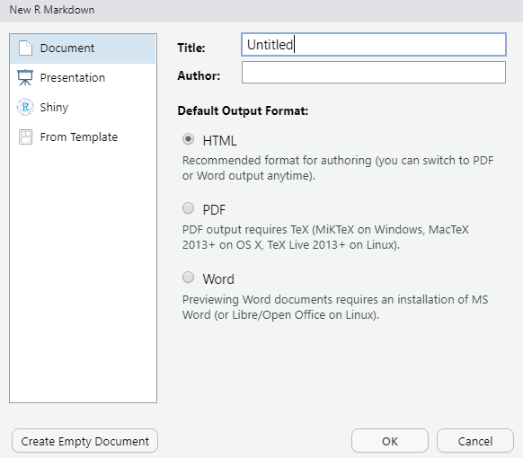
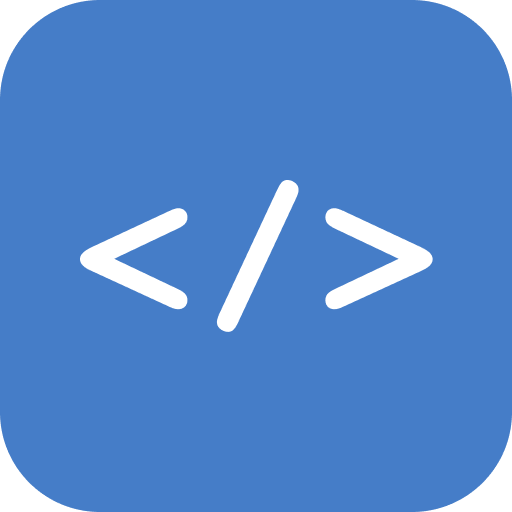
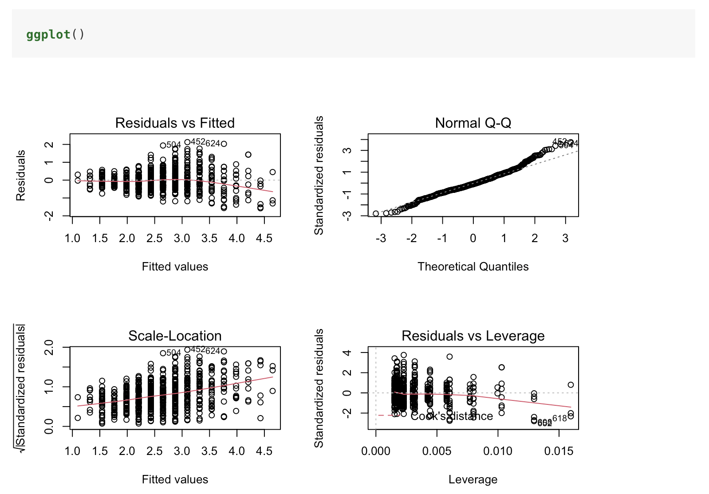
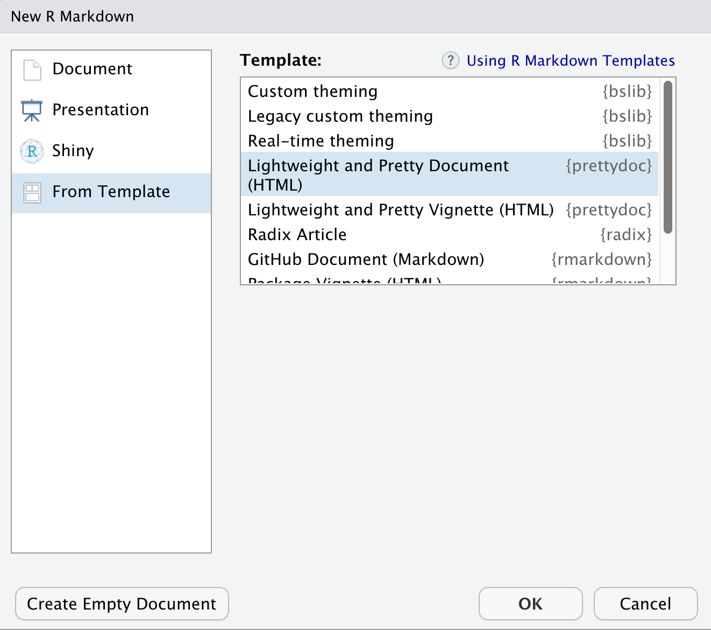
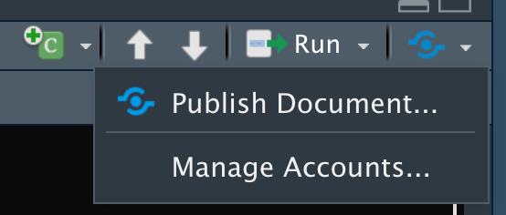

```{r setup, include=FALSE}
# which python3
library(reticulate)
use_python("/usr/local/bin/python3")
library(knitr)
```

**RMarkdown** --- это пакет, который позволяет соединять текст, исполняемый код и результаты исполнения кода в единый документ. Это очень полезно для представления данных. На выходе мы можем получить файлы `.html`, `.pdf` --- в том числе презентации форматов `.html` и `.pdf`[^pdf_pres] --- `.docx`, `.pptx`. Более того, можно связать несколько HTML-документов и получить сайт или книгу. Ну, гениально же!

Мы сосредоточимся на HTML-документах сегодня, потому что это проще всего и, как показывает практика, полезнее всего.

[^pdf_pres]: Потребуется [Beamer](https://en.wikipedia.org/wiki/Beamer_(LaTeX))


## Установка {#installing}

> Если вдруг ещё не, надо поставить R ([Win](https://cran.r-project.org/bin/windows/base/), [Mac](https://cran.r-project.org/bin/macosx/), [Linux](https://cran.rstudio.com/bin/linux/)) и [RStudio](https://www.rstudio.com/products/rstudio/download/).

Устанавливается RMarkdown как обычный пакет:

```{r, eval=FALSE}
install.packages("rmarkdown")
```

Есть ещё пакет, который не обязательно устанавливать сразу, но он нам пригодится, чтобы делать красивое:

```{r, eval=FALSE}
install.packages("prettydoc")
```


## Структура документа {#structure}

* [YAML](https://en.wikipedia.org/wiki/YAML)-шапка
* самый обычный текст (как в блокноте) с форматированием от [Markdown](https://en.wikipedia.org/wiki/Markdown), расширенным с помощью [Pandoc](https://en.wikipedia.org/wiki/Pandoc)
* блоки [кода](#code) (в целом, на любом языке программирования)
* формулы в $\LaTeX$’e


### Чё внутри происходит? {#under-the-hood}

Кратко взглянем на то, как из `.rmd` получается `.html`.

1. Мы пишем руками `.rmd.`шку (RMarkdown).
2. Отправляем её пакету `knitr`, который выполняет чанки кода и делаем `.md`шку (Markdown).
3. Дальше `.md`шку берёт Pandoc, который есть конвертер, и делает окончательный файл, который мы пожелали --- например, `html`ку или `.pdf.`ку, призывая $\LaTeX$.


<center>

</center>
<p style="float:right; font-size:10pt; margin-top:-5px">
[Источник](https://bookdown.org/yihui/rmarkdown-cookbook/rmarkdown-process.html)
</p>


### Первый `.rmd`-файл

Как создать `.rmd`шку? Надо проследовать по пути `File > New File > RMarkdown...`, оставить все настройки по умолчанию и жмакнуть `OK`.

<center>

</center>

Возникнет дефолтный `.rmd`-файл.

````
---
title: "Untitled"
output: html_document
---

```{r setup, include=FALSE}`r ''`
knitr::opts_chunk$set(echo = TRUE)
```

## R Markdown

This is an R Markdown document. Markdown is a simple formatting syntax for authoring HTML, PDF, and MS Word documents. For more details on using R Markdown see <http://rmarkdown.rstudio.com>.

When you click the **Knit** button a document will be generated that includes both content as well as the output of any embedded R code chunks within the document. You can embed an R code chunk like this:

```{r cars}`r ''`
summary(cars)
```

## Including Plots

You can also embed plots, for example:

```{r pressure, echo=FALSE}`r ''`
plot(pressure)
```

Note that the `echo = FALSE` parameter was added to the code chunk to prevent printing of the R code that generated the plot.

````

Его можно скомпилировать либо с помощью функции `rmarkdown::render("file.Rmd")`, либо жмакнув кнопку `Knit` вверху текстового редактора.

<center>

</center>

Если по дороге ничего не сломалось, то должно получиться [что-то такое](first-rmd.html).


***



<div class="task">
Создайте и скомпилируйте дефолтный `.rmd`-файл.
</div>

***


## Markdown & Pandoc {#markdown}

* Markdown --- это универсальный язык разметки, использующийся очень много где.
* Pandoc --- конвертер файлов между различными форматами. А ещё он дает немного плюшек для форматирования ([индексы](#sub-and-superscripts), [нумерованные примеры](#numbering), [сноски](#footnotes)).


### Заголовки {#headers}

Обозначаются хэштегами, после которых надо обязательно поставить пробел, иначе получится [ссылка](#tag).

```
# Заголовок 1

## Заголовок 2

### Заголовок 3

#### Заголовок 4

##### Заголовок 5

###### Заголовок 6

```


На заголовках можно оставлять теги --- они не отображаются --- чтобы организовывать [навигацию по документу](#links):

```
# Заголовок 1 {#tag1}

## Заголовок 2 {#header2}

### Заголовок 3 {#wow_third_level_header}
```


### Форматирование {#formatting}

* *Курсив / наклон* --- `*курсив* или _курсив_`
* **Полужирный** --- `**полужирный** или __полужирный__`
* ~~Зачеркнутый~~ --- `~~зачеркнутый~~`


#### Индексы {#sub-and-superscripts}

* Нижние индексы --- CH~3~CH~2~OH --- в тильдах --- `CH~2~CH~3~OH`
* Верхние индексы --- К^+^, Cr~2~O~7~^2-^ --- в шапочках --- `К^+^, Cr~2~O~7~^2-^`


### Списки {#lists}

Есть несколько вариантов и все рабочие:

#### Ненумерованные списки

```
* овощи
    * томаты
    * все остальные
* фрукты
    * обыкновенные
        * яблоко
        * груша
    * тропические
        * папайя
        * маракуйя
* ягоды
    * удобные для сбора
    * крыжовник
```

<div class="example">
* овощи
    * томаты
    * все остальные
* фрукты
    * обыкновенные
        * яблоко
        * груша
    * тропические
        * папайя
        * маракуйя
* ягоды
    * удобные для сбора
    * крыжовник
</div>

Ещё можно плюсами и минусами пользоваться, типа вот так

```
- овощи
    + томаты
    + все остальные
- фрукты
    + обыкновенные
        - яблоко
        - груша
    + тропические
        - папайя
        - маракуйя
- ягоды
    - удобные для сбора
    - крыжовник
```

<div class="example">
- овощи
    + томаты
    + все остальные
- фрукты
    + обыкновенные
        - яблоко
        - груша
    + тропические
        - папайя
        - маракуйя
- ягоды
    - удобные для сбора
    - крыжовник
</div>

#### Нумерованные списки

```
1. рыба
   1. карп
   3. треска
   2. камбала
2. мясо
    1. всякое
    2. разное
3. ни рыба ни мясо
   1. птица
      1. кура
      4. перепёлка
   2. инопланетное непонятно что
```

<div class="example">
1. рыба
   1. карп
   3. треска
   2. камбала
2. мясо
    1. всякое
    2. разное
3. ни рыба ни мясо
   1. птица
      1. кура
      4. перепёлка
   2. инопланетное непонятно что
</div>

Смотрите, даже если мы накосячили в нумерации, при компиляции всё поправилось, и нумерация в итоговом доке верная.


### Нумерованные примеры {#numbering}

В списки можно собирать некоторые примеры:

```
(@) Парменид сказал, что «бытие есть --- небытия нет». Трудно поспорить.
(@socrates) Сократ заявил, что он «знает, что ничего не знает, но другие не знают даже этого». Ну, ок.
(@plato) Платон задвигал про мир идей.
(@aristotle) Аристотель нам основал все науки.
```

<div class="example">
(@) Парменид сказал, что «бытие есть --- небытия нет». Трудно поспорить.
(@socrates) Сократ заявил, что он «знает, что ничего не знает, но другие не знают даже этого». Ну, ок.
(@plato) Платон задвигал про мир идей.
(@aristotle) Аристотель нам основал все науки.
</div>


Во-вервых, они будут автоматически нумероваться, а во-вторых, если к ним приписать лейблы (здесь: `socrates`, `plato`, `arislotle`). Можно будет ссылаться на примеры:

```
Считается, что (@plato) записывал за (@socrates).
```

<div class="example">
Считается, что (@plato) записывал за (@socrates).
</div>


### Ссылки {#links}

Вариантов есть несколько и вот они, пожалуй, все.

```
Вставляем [ссылку](https://www.google.com/) красиво.

Или не очень красиво, но зато ясно, куда она ведет: <https://www.google.com/>.

Если хочется собрать все ссылки в одном месте, то для отображения их в тексте можно оставить [метку][1] или даже просто [метку].

А ещё если у вас есть теги на заголовках, можно ссылаться и внутрь документа, например [так](#tables).

[1]: https://www.google.com/
[метку]: https://yandex.ru/

```

<div class="example">

Вставляем [ссылку](https://www.google.com/) красиво.

Или не очень красиво, но зато ясно, куда она ведет: <https://www.google.com/>.

Если хочется собрать все ссылки в одном месте, то для отображения их в тексте можно оставить [метку][1] или даже просто [метку].

[1]: https://www.google.com/
[метку]: https://yandex.ru/

А ещё если у вас есть теги на заголовках, можно ссылаться и внутрь документа, например [так](#tables).

</div>


### Картинки {#pics}

Очень похожи по синтаксису на ссылки, только перед квадратными скобками надо поставить `!`,а внутри них пишется либо ничего, либо [альтернативный текст](https://en.wikipedia.org/wiki/Alt_attribute)/название картинки. В круглых скобках пишется адрес картинки.

```


```

<div class="example">


</div>

Да, прямо веб-ссылку можно впихнуть туда.

```
Метки здесь так же работают. ![][cat_shocked]

[cat_shocked]: cat_shocked.png
```

<div class="example">
Метки здесь также работают. ![][cat_shocked]

[cat_shocked]: cat_shocked.png
</div>


<font size=2>Лично я не большой фанат вставлять картинки средствами Markdown, поэтому использую HTML. Там больше возможностей кастомизации отображения.</font>


### Цитаты {#quotes}

Цитаты оформляются с помощью знака `>`:

```
> Это цитата, которая содержит глубокую философскую мысль.
> Тут мысль раскрывается --- это строка попадает в тот же фрагмент.

> А это уже _следующая_ цитата, в которой применяется __форматирование__.
>
> <p align="right">Автор цитаты</p>
```


> Это цитата, которая содержит глубокую философскую мысль.
> Тут мысль раскрывается --- это строка попадает в тот же фрагмент.

> А это уже _следующая_ цитата, в которой применяется __форматирование__.
>
> <p align="right">Автор цитаты[^align_right]</p>

[^align_right]: Здесь использован HTML-тег `p` для того, чтобы сделать выравнивание имени автора по правому краю. К сожалению, сам Markdown про выравнивание ничего не знает :(

### Разрыв страницы {#page-break}

Делается тремя звёздочками: `***`. Выглядит так:

***


### Таблицы {#tables}

Делать руками таблицы --- достаточно запарно. В общем-то, не только в Markdown, но и в HTML или $\LaTeX$ тоже. К тому же, не то чтобы нам очень часто надо делать таблицы руками. Поэтому не будем тратить на это много времени и внимания, и просто сохраним [ссылку на генератор таблиц](http://www.tablesgenerator.com/markdown_tables).


### Сноски {#footnotes}

Делаются так:

```
Это сноска[^1].
Но лучше не номером, а как-то так[^another_footnote].

[^1]: Да, это сноска.
[^another_footnote]: Да, это тоже сноска, только не по номеру, а через лейбл.
```

<div class="example">
Это сноска[^1].
Но лучше не номером, а как-то так[^another_footnote].

[^1]: Да, это сноска.
[^another_footnote]: Да, это тоже сноска, только не по номеру, а через лейбл.

</div>

Разницы, где оставлять содержание сноски, особой нет --- можно сразу после абзаца, в котором сноска даётся, можно в конце документа.

<font size=2>Я предпочитаю первый вариант, чтобы можно было следовать за содержанием документа и не прыгать по нему, если нужны исправления.</font>


***


<div class="task">
Представим, что вам пора писать статью. Создайте шаблон для неё в RMarkdown.

Шаблон должен содержать:

- заголовки основных разделов
- пара строк текста в каждом разделе, о чем будет этот раздел
- суперважная сноска в каком-нибудь из разделов
- ссылка на какой-то внешний ресурс (например, откуда вы взяли стимульный материал)
- цитата великого ученого, на работы которого вы опираетесь
</div>

***


## HTML {#html}

Ежели вы монстр и постигли HTML, то можно прям на нём делать вставки в RMarkdown. Ну, скажем, список можно сделать и так:

```
<ul>
    <li>пункт номер раз</li>
    <li>пункт номер два</li>
    <li>пункт номер три</li>
</ul>

```

<div class="example">
<ul>
    <li>пункт номер раз</li>
    <li>пункт номер два</li>
    <li>пункт номер три</li>
</ul>
</div>


Кстати, HTML и Markdown можно комбинировать, и это будет работать:

```
Допустим,
<dl>
   <dt>__термин__</dt>
   <dd> и его определение, в котором нужно сделать _акцент_, либо <em>акцент</em>.</dd>
</dl>
```

<div class="example">
Допустим,
<dl>
   <dt>__термин__</dt>
   <dd> и его определение, в котором нужно сделать _акцент_, либо <em>акцент</em>.</dd>
</dl>
</div>


## $\LaTeX$ {#latex}

С помощью $\LaTeX$'а можно писать красивые формулы. Хорошо, конечно, если вы шарите за $\LaTeX$, но если нет, можно посмотреть 100500 примеров [тут](http://www.ccas.ru/voron/download/voron05latex.pdf).

### Сверхкраткое введение в математику в $\LaTeX$'е

* Есть формулы. Они бывают *внутритекстовые*, которые --- шок! --- идут внутри текста, и *выключные*, которые вынесены в отдельную строку.
* Внтуритекстовые формулы оформляются с помощью одинарных знаков доллара `$ formula $` примерно так:

````
Если верить тому, что $2 + 2 = 4$, то получается, что $22 + 22 = 44$.
````

<div class="example">
Если верить тому, что $2 + 2 = 4$, то получается, что $22 + 22 = 44$.
</div>

* Выключные формулы оформляются с помощью двойных знаков доллара `$$ formula $$`. Они всегда выравнены по центру.

````
Кажется, что если сложить несколько чисел и поделить на их количество, получится нечто, именуемое _средним арифметическим_:

$$
\bar x = \frac{1}{n} \sum_{i=1}^n x_i
$$
  
Будем думать, что это действительно так.
````

<div class="example">
Кажется, что если сложить несколько чисел и поделить на их количество, получится нечто, именуемое _средним арифметическим_:

$$
\bar x = \frac{1}{n} \sum_{i=1}^n x_i
$$

Будем думать, что это действительно так.
</div>


* Есть куча разных операторов-функций типа `\bar`, `\sum`, `\frac`, `\times` и др. Они позволяют вводить всякие разные математические символы. Какие они есть и как их употреблять, можно опять же смотреть [тут](http://www.ccas.ru/voron/download/voron05latex.pdf).


***


<div class="task">
Давайте напишем какую-нибудь формулу в свою статью, что сделать вид, что мы жесть какие умные и что-то понимаем в том, что исследуем. Например, что-то умное про логистическую регрессию:

$$
p_i = \frac{e^{\beta_0 + \sum_{k=1}^p \beta_kx_{ik}}}{1 + e^{\beta_0 + \sum_{k=1}^p \beta_kx_{ik}}}
$$

или просто что-то на статистическом про диперсию:

$$
\mathbb{D}(X) = \mathbb{E}(X^2) - \mathbb{E}^2(X)
$$
</div>

***


## Код {#code}

Код заключается в [бэктики](backticks.html): `` `sum(1, 2, 3)` ``. Это если мы хотим код прямо в строке. Если хотим код отдельным чанком, то по три бэктика в начале и конце:

````
```
x <- c(1,3,5,7)
mean(x)
```
````

Правда такие чанки кода не исполняются. Нам такого не надо. Чтобы исполнить код при компиляции файла, надо указать, на каком языке мы написали заклинания.


### Языки программирования {#languages}

Это указывается после первых бэктиков (допустим, мы почему-то пишем на R):

````
```{r}`r ''`
x <- c(1,3,5,7)
mean(x)
```
````

```{r}
x <- c(1,3,5,7)
mean(x)
```


Можно сделать и питон[^run_python]:

[^run_python]: Чтобы оно поехало, нало будет создать чанк, в котором подгружается пакет `reticulate` (стандартно, через `library(reticulate)`) и указывается, какой питон использовать при исполнении кода через `use_python("path_to_python")`. Путь к питону можно узнать через командную строку с помощью `which python3`.

````
```{python}`r ''`
spisok = ["where", "is", "my", "beer"]
for word in spisok:
    print(word)
```
````


```{python}
spisok = ["where", "is", "my", "beer"]
for word in spisok:
    print(word)
```

Можно вытворить и нечто подобное:

```{bash}
echo "хало ворлд"
```

Если вы совсем странненький, то можно сделать и что-то такое:

```{r engine='Rcpp'}
#include <Rcpp.h>

// [[Rcpp::export]]
int fibonacci(const int x) {
    if (x == 0 || x == 1) return(x);
    return (fibonacci(x - 1)) + fibonacci(x - 2);
}
```

```{r}
fibonacci(10L)
```


### Настройка чанков {#chunk-settings}

У чанков достаточно много настроек. Самые важные --- `echo`, `eval` и `include`.

````
Отображается и код, и аутпут:

```{r}`r ''`
# Pharmacokinetics of Indomethacin
head(Indometh)
```

Отображается, но *не* исполняется:

```{r, eval=FALSE}`r ''`
# это я просто покажу, как пакет c гитхаба подгрузить
# полезный пакет, кстати, там есть неплохие шаблоны
devtools::install_github("rstudio/radix")
```

*Не* отображается код, но выводится аутпут:

```{r, echo=FALSE}`r ''`
print("о боже, как много настроек, я уже забыл, какая первая была")
```

*Не* отображается *ни* код, *ни* аутпут, но чанк исполняется[^include]:

```{r, include=FALSE}`r ''`
vec <- 1:24
```

[^include]: Параметр `include` в основном используется для задания параметров верстки.

Это значит, что хоть мы и не видим, что вектор создан, мы можем к нему обратиться:

```{r}`r ''`
vec
```
````

<div class="example">
Отображается и код, и аутпут:

```{r}
# Pharmacokinetics of Indomethacin
head(Indometh)
```

Отображается, но *не* исполняется:

```{r, eval=FALSE}
# это я просто покажу, как пакет c гитхаба подгрузить
# полезный пакет, кстати, там есть неплохие шаблоны
devtools::install_github("rstudio/radix")
```

*Не* отображается код, но выводится аутпут:

```{r, echo=FALSE}
print("о боже, как много настроек, я уже забыл, какая первая была")
```

*Не* отображается *ни* код, *ни* аутпут, но чанк исполняется[^include]:

```{r, include=FALSE}
vec <- 1:24
```

[^include]: Параметр `include` в основном используется для задания параметров верстки.

Это значит, что хоть мы и не видим, что вектор создан, мы можем к нему обратиться:

```{r}
vec
```
</div>

Если и [другие](https://yihui.org/knitr/options/#chunk_options) аргументы, их много. Кратко перечислю самые полезные:

* `error` --- отображать ли ошибки исполнения:
  * если `FALSE`, то верстка ломается на чанке, который не может выполниться
  * если `TRUE`, то верстка не ломается, а ошибка отображается в итоговом файле
* `warning` --- отображать ли предупреждения
* `message` --- отображать ли сообщения (например, при подключении пакетов)
* `comment` --- по дефолту результат работы кода предваряется знаком `##`
  * чтобы его не было, надо прописать `NA`
* `cache` --- кэшировать ли результат работы фрагмента кода
  * Полезная фича, когда вы работаете с какими-либо сложными или большими операциями, занимающими много времени. Если результата закэшировн, он не будет пересчитываться при новой компиляции --- значит, будет тратиться меньше времени.


### Именование чанков {#chunk-naming}

Каждому чанку можно дать собственное имя (без пробелов и точек внутри имени). Оно указывается после языка:

````
```{r my_super_fancy_graph}`r ''`
library(tidyverse)
theme_set(theme_bw())
diamonds %>% 
  ggplot(aes(price)) +
  geom_histogram(data = diamonds %>% select(-color), fill="lightgray") +
  geom_histogram(aes(fill = color)) +
  facet_wrap(~ color)
```
````

```{r}
library(tidyverse)
theme_set(theme_bw())
diamonds %>% 
  ggplot(aes(price)) +
  geom_histogram(data = diamonds %>% select(-color), fill="lightgray") +
  geom_histogram(aes(fill = color)) +
  facet_wrap(~ color)
```

В целом, этого можно и не делать, однако есть [несколько причин](https://masalmon.eu/2017/08/08/chunkpets/) этого делать:

* проще читать код
* проще ориентироваться в том, что вы написали год назад
* в случае ошибок при компиляции будет отображаться имя чанка, а не номер
* если чанк закэширован, при добавлении нового перед ним не надо все опять пересчитывать
* можно ссылаться в `blogdown`
* при верстке книг в `bookdown` вы избежите косяков по типу того, что на картинке

<center>

</center>

***


<div class="task">
Возьмите какой-либо встроенный датасет (`library(help = "datasets")`) и напишите код, который: 

* выведет описательные статистики по какой-то количественной переменной
* визуализирует её распределение
</div>

***


## YAML-шапка {#yaml}

Это то, что находится вверху документа и содержит какие-то метаданные о вашем файле. Например, вот

```
---
title: "RMarkdown: верстаем красивое"
author: "Антон Ангельгардт"
date: "31.08.202"
output:
  prettydoc::html_pretty:
    theme: architect
    highlight: github
    toc: yes
    toc_depth: 3
    css: "style.css"
---
```


### Тип аутпута {#output}

Пожалуй, самое важное. Есть несколько вариантов:

* `output: html_document` --- это настроено по умолчанию
* `output: word_document`
* `output: pdf_document` (придется подружить с $\LaTeX$ом на вашем компе)
* `output: ioslides_presentation`
* `output: slidy_presentation`
* `output: slidy_presentation`
* `output: beamer_presentation`
и т.д., и т. п., и пр., и др.


### Библиография {#bibtex}

Здесь мы упомянем `BibTeX`, который вообще-то хорошо дружит с $\LaTeX$, но сюда прикрепить тоже можно. Это не единственный способ, но, наверное, самый универсальный.

1. Создаем файл `.bib` со всей библиографией. [GoogleScholar](https://scholar.google.com/) генерирует ссылки в формате `BibTeX` автоматически.

```
@book{xie2016bookdown,
  title={Bookdown: Authoring books and technical documents with R markdown},
  author={Xie, Yihui},
  year={2016},
  publisher={Chapman and Hall/CRC}
}

@book{xie2017blogdown,
  title={Blogdown: creating websites with R markdown},
  author={Xie, Yihui and Thomas, Amber and Hill, Alison Presmanes},
  year={2017},
  publisher={Chapman and Hall/CRC}
}
```

2. Прописываем в шапке, какой файл отвечает за библиографию:

```
bibliography: references.bib
```

3. Используем ссылки в тексте, как [вот тут](#more)

```
* `bookdown` --- [расширение RMarkdown](https://bookdown.org/yihui/bookdown/) для написания книг, диссера, создания перезентаций и т.д. (@xie2016bookdown)
* `blogdown` --- сайты [можно пилить](https://bookdown.org/yihui/blogdown/) (@xie2017blogdown)
```

4. Список литературы сам формируется в конце.


### Оглавление {#toc}

Есть несколько атрибутов, которые позволяют задать оформление оглавления:

* `toc` --- вставлять ли оглавление финальный док
* `toc_depth` --- сколько уровней иерархии отображать в оглавлении
* `toc_float` --- должно ли оглавление все время следовать за текстом
* `collapsed` --- должно ли оглавление быть все время полностью раскрыто
* `number_sections` --- автоматическая нумерация секций
* `code_folding (hide)` --- делать ли кнопочку, показывающую/скрывающую весь код


## Отображение датафреймов {#df}

Мы уже выше видели, что будет, если попытаться вывести датафрейм --- что-то такое:

```{r}
head(diamonds)
```

Некрасиво.

Надо, чтобы было красиво.

Для этого есть удобненькая функция `kable()` в пакете `knitr`. Во-первых, она сделаем красивое сама, во-вторых, там можно переименовать колонки --- а это важно, ибо переменные в датасете обычно не то чтобы очень понятно и понимабельно называются.

```{r}
head(diamonds) %>% 
  kable(col.names=str_to_title(colnames(.)))
```


***


<div class="task">
Давайте

* добавим оглавнение в нашу статью
* покажем, как выглядели данные (то есть, отобразим часть датафрейма, по которому считали описательные статистики, красиво.)
</div>

***


## Дизигн {#design}

### CSS {#css}

Если вы магистр всея [Cascading Style Sheets](https://en.wikipedia.org/wiki/CSS), то можете полностью накастомизировать все, что хотите. Только подключите потом к самому файлу:

```
css: "style.css"
```

### Макеты с темами {#themes}

Мы в самом начале установили пакет `prettydoc`, который содержит в себе весьма pretty темы для RMarkdown-документов. Создать `prettydoc`-файл можно так:

`File > New File > RMarkdown... > From Template > Lightweight and Pretty Document (HTML)`

<center>

</center>

YAML-шапка генерируется автоматически, что хорошо. Если вам не нравится, какая тема применилась по умолчанию, можно выбрать [другую](https://prettydoc.statr.me/themes.html).

```
theme: architect
```


***


<div class="task">
Примените какую-нибудь тему из пакета `prettydoc`, чтобы статья стала неистово pretty.
</div>

***


## Куда заливать HTML? {#html-hosts}

В качестве аутпута мы получаем файл `.html`, а значит, чтобы мир его увидел, он должен быть где-то в интернетах. Вариантов несколько:

* вы завели собственный хост и живете прекрасно
* вы завели GitHub и включили GitHub Pages и живете не менее прекрасно
* вы пользуетесь бесплатным хостингом Rpubs

<center>

</center>


## Что ещё? {#more}

Представление данных, конечно, не ограничивается RMarkdown. Вот некоторые штуки, которые также могут быть полезны:

* `bookdown` --- [расширение RMarkdown](https://bookdown.org/yihui/bookdown/) для написания книг, диссера, создания перезентаций и т.д. (@xie2016bookdown)
* `shiny` --- динамические сайты, на которых можно развернуть взамодействие с пользователем
* `flexdashboard` --- динамические дэшборды
* `posterdown` --- постеры в RMarkdown
* `pagedown` --- тут много всяких шаблонов примерно для всего (от книги, статьи и резюме до приглашения на свадьбу)
* `blogdown` --- сайты [можно пилить](https://bookdown.org/yihui/blogdown/) (@xie2017blogdown)


## Список литературы
